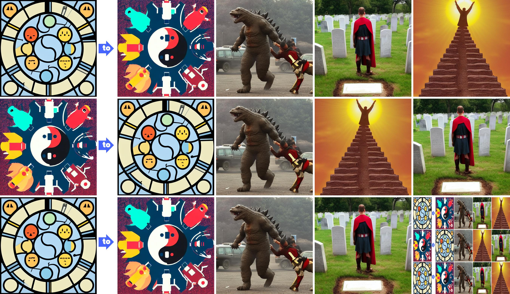

quickly turn a bunch of images into a collage like this:

images are labeled 1_1.jpg 1_2.jpg etc for as many rows and cols you want.
Images were generated from this [stable diffusion api](https://88stacks.com)
